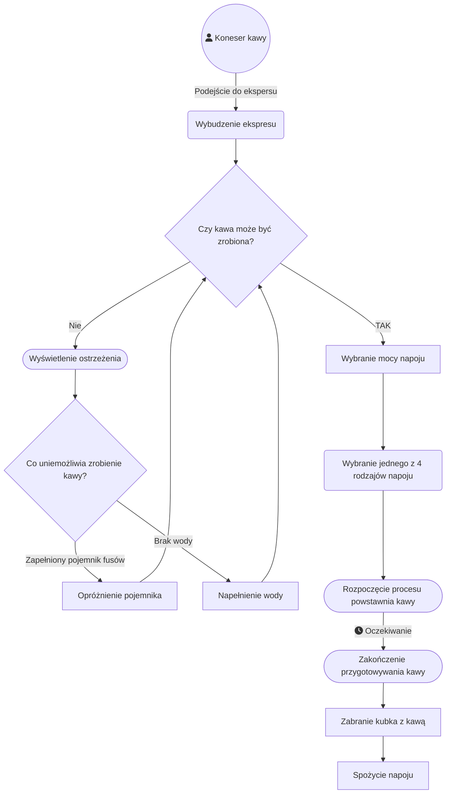

# Dokumentacja projektu Coffe Anril

# Tabela zawartości
- [Dokumentacja projektu Coffe Anril](#dokumentacja-projektu-coffe-anril)
- [Tabela zawartości](#tabela-zawartości)
  - [Analiza wymagań](#analiza-wymagań)
    - [Wymagania funkcjonalne:](#wymagania-funkcjonalne)
    - [Wymagania niefunkcjonalne:](#wymagania-niefunkcjonalne)
    - [Przypadek użycia](#przypadek-użycia)
      - [Przygotowanie napoju](#przygotowanie-napoju)
      - [Odwzorowywane urządzenie](#odwzorowywane-urządzenie)
  - [Konstrukcja systemu](#konstrukcja-systemu)
    - [Opis wybranej technologii/specyfikacja projektu](#opis-wybranej-technologiispecyfikacja-projektu)
      - [Blender ver. 4.0](#blender-ver-40)
      - [Unreal Engine ver. 5.1.1](#unreal-engine-ver-511)
    - [Blueprinty](#blueprinty)
  - [Dokumentacja kodu](#dokumentacja-kodu)
    - [InteractionComponent.cpp](#interactioncomponentcpp)
      - [Zawartość pliku](#zawartość-pliku)
      - [Opis poszczególnych metod](#opis-poszczególnych-metod)
        - [1. `UInteractionComponent::UInteractionComponent()`](#1-uinteractioncomponentuinteractioncomponent)
        - [2. `void UInteractionComponent::InitComponnent(ACharacter* PlayerCharacter, APlayerController* PlayerController)`](#2-void-uinteractioncomponentinitcomponnentacharacter-playercharacter-aplayercontroller-playercontroller)
        - [3. `void UInteractionComponent::SetCanCheckInteraction(bool CanCheck)`](#3-void-uinteractioncomponentsetcancheckinteractionbool-cancheck)
        - [4. `void UInteractionComponent::TryToInteract()`](#4-void-uinteractioncomponenttrytointeract)
        - [5. `void UInteractionComponent::BeginPlay()`](#5-void-uinteractioncomponentbeginplay)
        - [6. `void UInteractionComponent::CheckCurrentActor()`](#6-void-uinteractioncomponentcheckcurrentactor)
        - [7. `void UInteractionComponent::OnLoseActor()`](#7-void-uinteractioncomponentonloseactor)
        - [8. `void UInteractionComponent::TickComponent(float DeltaTime, ELevelTick TickType, FActorComponentTickFunction *ThisTickFunction)`](#8-void-uinteractioncomponenttickcomponentfloat-deltatime-eleveltick-ticktype-factorcomponenttickfunction-thistickfunction)
  - [Samouczek obslugi aplikacji](#samouczek-obslugi-aplikacji)
    - [1. Uruchomienie aplikacji](#1-uruchomienie-aplikacji)
    - [2. Sterowanie](#2-sterowanie)
      - [Poruszanie się](#poruszanie-się)
      - [Sterowanie kamerą](#sterowanie-kamerą)
      - [Interakcje z przedmiotami](#interakcje-z-przedmiotami)


## Analiza wymagań

Celem projektu było przygotowanie wirtualnej prezentacji sprzętu AGD - Ekspresu do kawy -  aby umożliwić przyszłemu użytkownikowi możliwość zapozniania się z jego funkcjonalnością oraz obsługą.

### Wymagania funkcjonalne:
- Możliwość przygotowania różnych rodzajów napoju kawowego za pomocą wyświetcza dotykowego lub przycisku
- Uzupełnienie brakującej wody w ekspresie
- Usunięcie nadmiaru fusów
- Możliwość rozebrania urządzenia
- Możliwość zmiany parametrów napoju
  

### Wymagania niefunkcjonalne:
- Urzędzenie powinno wiernie odwzorowywać prawdziwe urządzenie
- Model urządzenia powinen składać się z kilku siatek 3D
- Obecność dźwięków
- Obecność cieni, przenikania lub gradientów
- Wybrana technologia powinna pozwalać na wykorzsytanie języka programowania

### Przypadek użycia

#### Przygotowanie napoju


#### Odwzorowywane urządzenie

**PHILIPS SAECO Granaroma SM6580**


## Konstrukcja systemu

### Opis wybranej technologii/specyfikacja projektu

Po analizie kompetencji własnych oraz rozwiązań rynkowych zdecydowaliśmy się na wykorzsytanie następujących narzędzi:
- **Oprogramowanie Blender** - służące do wykonania modelu 3D ekspresu
- **Środowisko silnika Unreal Engine** - do wykonania interakcji oraz środowiska wirtualnego służącego do prezentacji produktu
- **Photoshop** - wykonanie elementów graficznych interfejsu graficznego
  

#### Blender ver. 4.0
To darmowy profesjonalny program do tworzenia grafiki 3D. Modele utworzone w tym programie są w pełni kompatybilne z silnikiem Unreal Engine.
Dodatkowo w pełni przenoszą się wszystkie tekstury oraz właściwości modelu.

#### Unreal Engine ver. 5.1.1
Unreal Engine to zaawansowany silnik do tworzenia gier. Tworzy on kompleksowe środowisko do tworzenia interaktywnych wizualizacji 3D oraz symulacji. 
Projekty wykonane w tej technologii opierają się o następujące elementy:
- **Assety** - modele 2D bądź 3D tworzące środowisko graficzne
- **Kod w języku C++** - służący do dostosowywania i poszerzania możliwości silnika względem konkretnych potrzeb projektów
- **Blueprint`y** - dominujący system oparty na wizualnym interfejsie, który pozwala na tworzenie logiki gry za pomocą gotowych bloków logicznych, nazywanych "Node'ami". Pozwalają one określić zachowania różnych elementów gry.


### Blueprinty

## Dokumentacja kodu

Na istniejący kod programistyczny składają się następujące pliki:
- CharacterBase.cpp
- CoffeGroundsActor.cpp
- CoffeMachineBase.cpp
- ContainsersComponent.cpp
- HandItem.cpp
- InteractionComponent.cpp
- InteractionInterface.cpp

Zawarte w nich metody slużą do obsługi interakcji użytkownika z otoczeniem i obsługi kamery/widoku.

Z punktu widzenia projektu najważniejszy jest plik InteractionComponent.cpp, w który rozszerza klasę UInteractionComponent o metody odpowiedzialne za obslugę ekspresu do kawy.


### InteractionComponent.cpp

W pliku znajdują się następujące metody:

#### Zawartość pliku
```cpp
1. UInteractionComponent::UInteractionComponent()
2. void UInteractionComponent::InitComponnent(ACharacter* PlayerCharacter, APlayerController* PlayerController)
3. void UInteractionComponent::SetCanCheckInteraction(bool CanCheck)
4. void UInteractionComponent::TryToInteract()
5. void UInteractionComponent::BeginPlay()
6. void UInteractionComponent::CheckCurrentActor()
7. void UInteractionComponent::OnLoseActor()
8. void UInteractionComponent::TickComponent(float DeltaTime, ELevelTick TickType, FActorComponentTickFunction *ThisTickFunction)
```
#### Opis poszczególnych metod

##### 1. `UInteractionComponent::UInteractionComponent()`

Metoda ta inicjalizuje wykorzystanie funkcji Tick dla implementowanego komponentu. 
Funkcja ta jest integralną częścią środowiska Unreal i jest wywoływana podczas renderowania każdej klatki obrazu umożliwiając programowi reakcję.

Zmiana ta jest wykonywana poprzez ustawienie pola `PrimaryComponentTick.bCanEverTick` na wartość  `true;`


##### 2. `void UInteractionComponent::InitComponnent(ACharacter* PlayerCharacter, APlayerController* PlayerController)`

##### 3. `void UInteractionComponent::SetCanCheckInteraction(bool CanCheck)`

##### 4. `void UInteractionComponent::TryToInteract()`

##### 5. `void UInteractionComponent::BeginPlay()`

##### 6. `void UInteractionComponent::CheckCurrentActor()`

##### 7. `void UInteractionComponent::OnLoseActor()`

##### 8. `void UInteractionComponent::TickComponent(float DeltaTime, ELevelTick TickType, FActorComponentTickFunction *ThisTickFunction)`


## Samouczek obslugi aplikacji

Urządzenie, na którym ma zostać uruchomiona aplikacja musi spełniać następujące wymagania:
- [x] System operacyjny Windows 10
- [x] Dedykowana karta graficzna zgodna z DirectX 11 min. 4GB VRAM (NVIDIA GTX 1060)
- [x] Karta dźwiękowa zgodna z DirectX 11
- [x] Klawiatura i mysz

### 1. Uruchomienie aplikacji

Należy otworzyć pobrać i otworzyć plik `CoffeAnril.exe`.
Po uruchomieniu programu zostanie wyświetlony widok scenerii kuchennej, w której znajduje się ekspres do kawy.

### 2. Sterowanie

#### Poruszanie się
**W** - Ruch do przodu<br>

**S** - Ruch do tyłu<br>

**A** - Ruch w lewo<br>

**D** - Ruch w prawo
#### Sterowanie kamerą
Sterowanie kamerą odbywa się za pomocą ruchu myszy.
#### Interakcje z przedmiotami
**E** - Podniesienie przedmiotu, otworzenie ekspresu do kawy, podniesienie kubka oraz inne czynności interaktywne niezwiązane z obsługą interfejsu ekspresu do kawy.<br>
**R** - Wyjęcie butelki z wodą do napełnienia ekspresu.<br>
**Lewy przycisk myszy [LPM]** - Wypicie kawy z kubka trzymanego w ręce, opróżnienie fusów z pojemnika na fusy.<br>


