# Dokumentacja projektu Coffe Anril

# Tabela zawartości
- [Dokumentacja projektu Coffe Anril](#dokumentacja-projektu-coffe-anril)
- [Tabela zawartości](#tabela-zawartości)
  - [Przykładowe zdjęcia z programu](#przykładowe-zdjęcia-z-programu)
  - [Analiza wymagań](#analiza-wymagań)
    - [Wymagania funkcjonalne:](#wymagania-funkcjonalne)
    - [Wymagania niefunkcjonalne:](#wymagania-niefunkcjonalne)
    - [Przypadek użycia](#przypadek-użycia)
      - [Przygotowanie napoju](#przygotowanie-napoju)
      - [Odwzorowywane urządzenie](#odwzorowywane-urządzenie)
  - [Konstrukcja systemu](#konstrukcja-systemu)
    - [Opis wybranej technologii/specyfikacja projektu](#opis-wybranej-technologiispecyfikacja-projektu)
      - [Blender ver. 4.0](#blender-ver-40)
      - [Unreal Engine ver. 5.1.1](#unreal-engine-ver-511)
    - [Blueprinty](#blueprinty)
    - [Widget Blueprint](#widget-blueprint)
    - [Uwagi końcowe](#uwagi-końcowe)
  - [Dokumentacja kodu](#dokumentacja-kodu)
    - [InteractionComponent.cpp](#interactioncomponentcpp)
      - [Zawartość pliku](#zawartość-pliku)
      - [Opis poszczególnych metod](#opis-poszczególnych-metod)
        - [1. `UInteractionComponent::UInteractionComponent()`](#1-uinteractioncomponentuinteractioncomponent)
        - [2. `void UInteractionComponent::InitComponnent(ACharacter* PlayerCharacter, APlayerController* PlayerController)`](#2-void-uinteractioncomponentinitcomponnentacharacter-playercharacter-aplayercontroller-playercontroller)
        - [3. `void UInteractionComponent::SetCanCheckInteraction(bool CanCheck)`](#3-void-uinteractioncomponentsetcancheckinteractionbool-cancheck)
        - [4. `void UInteractionComponent::TryToInteract()`](#4-void-uinteractioncomponenttrytointeract)
        - [5. `void UInteractionComponent::BeginPlay()`](#5-void-uinteractioncomponentbeginplay)
        - [6. `void UInteractionComponent::CheckCurrentActor()`](#6-void-uinteractioncomponentcheckcurrentactor)
        - [7. `void UInteractionComponent::OnLoseActor()`](#7-void-uinteractioncomponentonloseactor)
    - [ContainersComponent.cpp](#containerscomponentcpp)
      - [Zawartość pliku](#zawartość-pliku-1)
      - [Opis poszczególnych metod](#opis-poszczególnych-metod-1)
        - [1. `UContainersComponent::UContainersComponent()`](#1-ucontainerscomponentucontainerscomponent)
        - [2. `void UContainersComponent::UpdateCurrentWaterLevel()`](#2-void-ucontainerscomponentupdatecurrentwaterlevel)
        - [3. `void UContainersComponent::UpdateCurrentCoffeLevel()`](#3-void-ucontainerscomponentupdatecurrentcoffelevel)
        - [4. `float UContainersComponent::UpdateLevelValue(float Value, float Target)`](#4-float-ucontainerscomponentupdatelevelvaluefloat-value-float-target)
        - [5. `void UContainersComponent::SetNewTargetWaterLevel(float NewTargetWaterLevel)`](#5-void-ucontainerscomponentsetnewtargetwaterlevelfloat-newtargetwaterlevel)
        - [6. `void UContainersComponent::SetNewTargetCoffeGroundsLevel(float NewTargetCoffeGroundsLevel)`](#6-void-ucontainerscomponentsetnewtargetcoffegroundslevelfloat-newtargetcoffegroundslevel)
        - [7. `void UContainersComponent::SetBlockedCoffeUpdate(bool blocked)`](#7-void-ucontainerscomponentsetblockedcoffeupdatebool-blocked)
        - [8. `float UContainersComponent::GetWaterLevel()`](#8-float-ucontainerscomponentgetwaterlevel)
        - [9. `float UContainersComponent::GetCoffeGroundsLevel()`](#9-float-ucontainerscomponentgetcoffegroundslevel)
        - [10. `void UContainersComponent::AddToTargetWaterLevel(float Value)`](#10-void-ucontainerscomponentaddtotargetwaterlevelfloat-value)
  - [Samouczek obslugi aplikacji](#samouczek-obslugi-aplikacji)
    - [1. Uruchomienie aplikacji](#1-uruchomienie-aplikacji)
    - [2. Sterowanie](#2-sterowanie)
      - [Poruszanie się](#poruszanie-się)
      - [Sterowanie kamerą](#sterowanie-kamerą)
      - [Interakcje z przedmiotami](#interakcje-z-przedmiotami)
    - [Instrukcja przygotowania napoju](#instrukcja-przygotowania-napoju)
    - [Instrukcja dolania wody](#instrukcja-dolania-wody)
    - [Instrukcja opróżnienia pojemnika na fusy](#instrukcja-opróżnienia-pojemnika-na-fusy)


## Przykładowe zdjęcia z programu


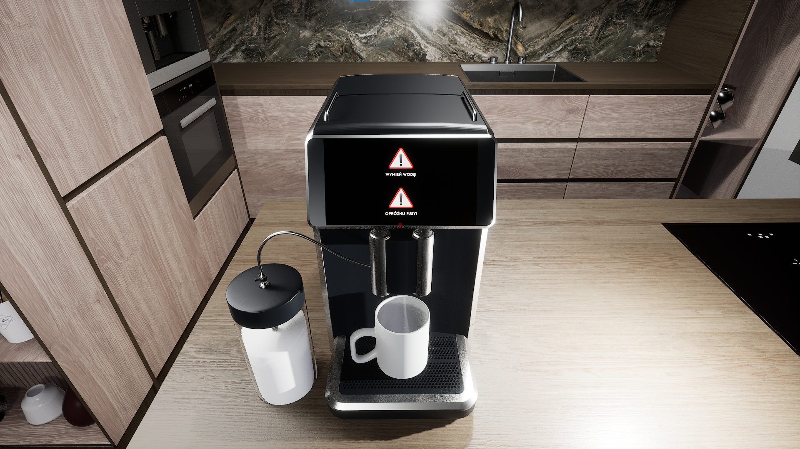

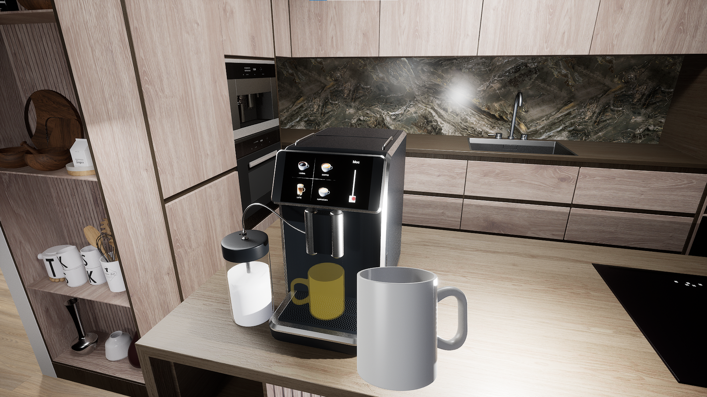

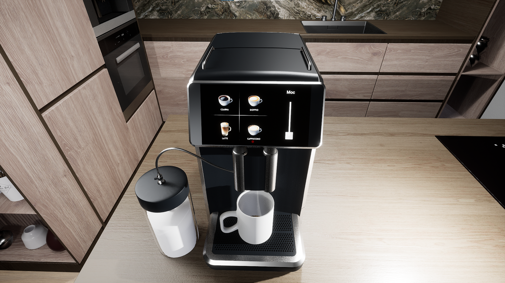


## Analiza wymagań

Celem projektu było przygotowanie wirtualnej prezentacji sprzętu AGD - Ekspresu do kawy -  aby umożliwić przyszłemu użytkownikowi możliwość zapozniania się z jego funkcjonalnością oraz obsługą.

### Wymagania funkcjonalne:
- Możliwość przygotowania różnych rodzajów napoju kawowego za pomocą wyświetcza dotykowego lub przycisku
- Uzupełnienie brakującej wody w ekspresie
- Usunięcie nadmiaru fusów
- Możliwość rozebrania urządzenia
- Możliwość zmiany parametrów napoju
  

### Wymagania niefunkcjonalne:
- Urzędzenie powinno wiernie odwzorowywać prawdziwe urządzenie
- Model urządzenia powinen składać się z kilku siatek 3D
- Obecność dźwięków
- Obecność cieni, przenikania lub gradientów
- Wybrana technologia powinna pozwalać na wykorzsytanie języka programowania

### Przypadek użycia

#### Przygotowanie napoju


#### Odwzorowywane urządzenie
<br>
<center>

**PHILIPS SAECO Granaroma SM6580**


</center>

## Konstrukcja systemu

### Opis wybranej technologii/specyfikacja projektu

Po analizie kompetencji własnych oraz rozwiązań rynkowych zdecydowaliśmy się na wykorzsytanie następujących narzędzi:
- **Oprogramowanie Blender** - służące do wykonania modelu 3D ekspresu
- **Środowisko silnika Unreal Engine** - do wykonania interakcji oraz środowiska wirtualnego służącego do prezentacji produktu
- **Photoshop** - wykonanie elementów graficznych interfejsu graficznego
  

#### Blender ver. 4.0
To darmowy profesjonalny program do tworzenia grafiki 3D. Modele utworzone w tym programie są w pełni kompatybilne z silnikiem Unreal Engine.
Dodatkowo w pełni przenoszą się wszystkie tekstury oraz właściwości modelu.

#### Unreal Engine ver. 5.1.1
Unreal Engine to zaawansowany silnik do tworzenia gier. Tworzy on kompleksowe środowisko do tworzenia interaktywnych wizualizacji 3D oraz symulacji. 
Projekty wykonane w tej technologii opierają się o następujące elementy:
- **Assety** - modele 2D bądź 3D tworzące środowisko graficzne
- **Kod w języku C++** - służący do dostosowywania i poszerzania możliwości silnika względem konkretnych potrzeb projektów
- **Blueprint`y** - dominujący system oparty na wizualnym interfejsie, który pozwala na tworzenie logiki gry za pomocą gotowych bloków logicznych, nazywanych "Node'ami". Pozwalają one określić zachowania różnych elementów gry.


### Blueprinty
Przykładowe Blueprinty odpowiadają za następujące mechaniki i interakcje:
- Nalewanie wody z butelki

Uzupełnienie butelki

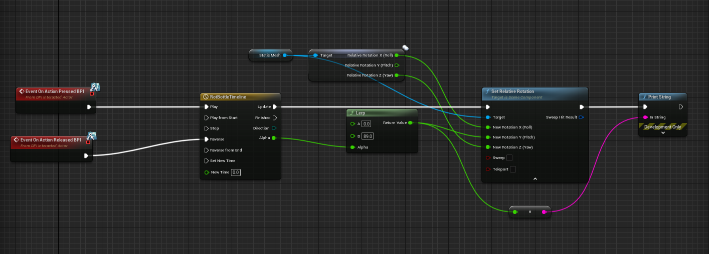


Wyjęcie butelki

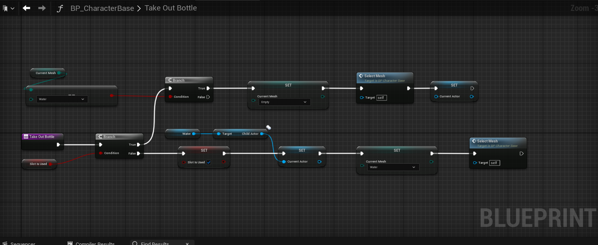


Dolanie wody do ekspresu

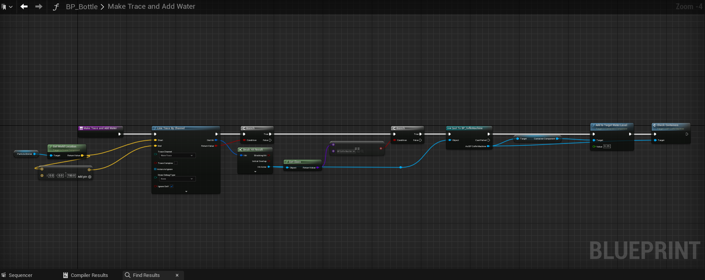

Zmiana poziomu cieczy

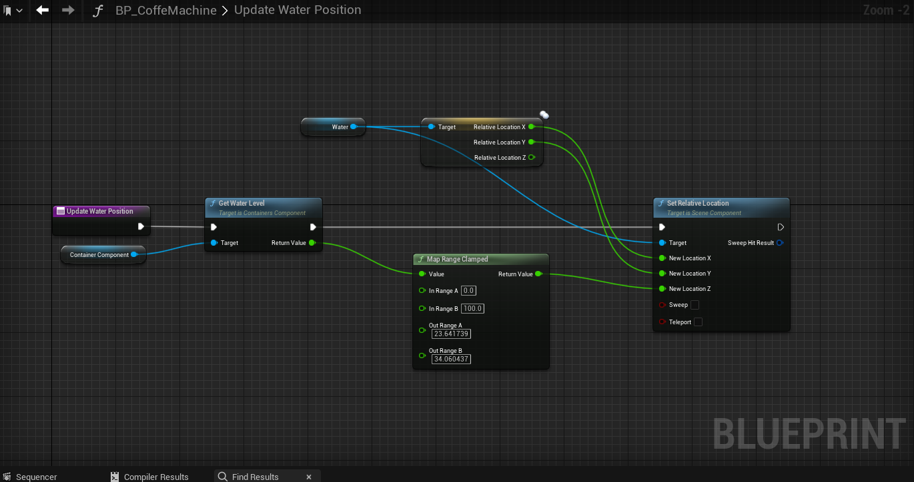


- Interakcje z kubkiem


Wyjmowanie, odkładanie kubka

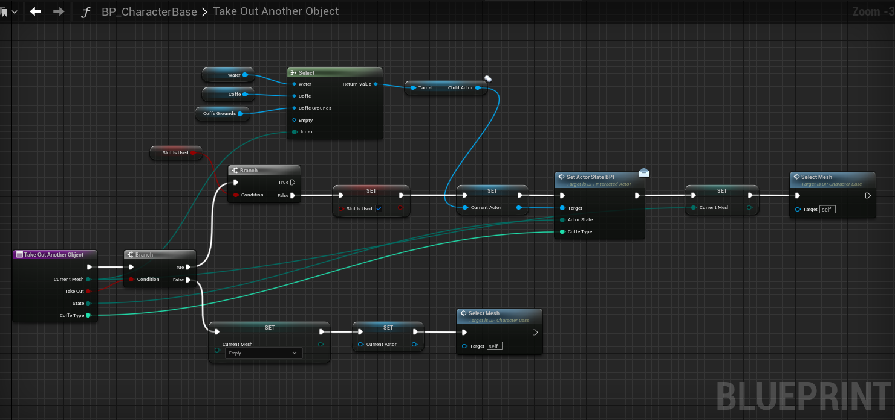

- Obsługa błędów i wyjątków

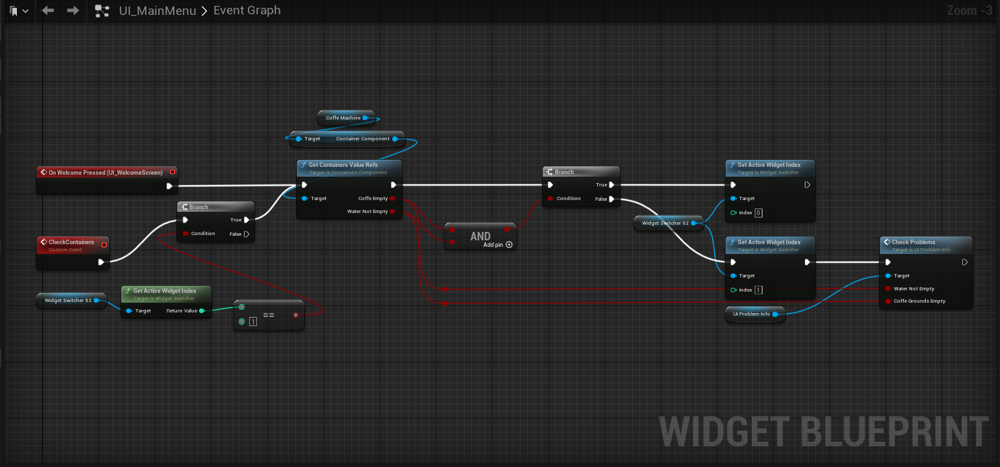


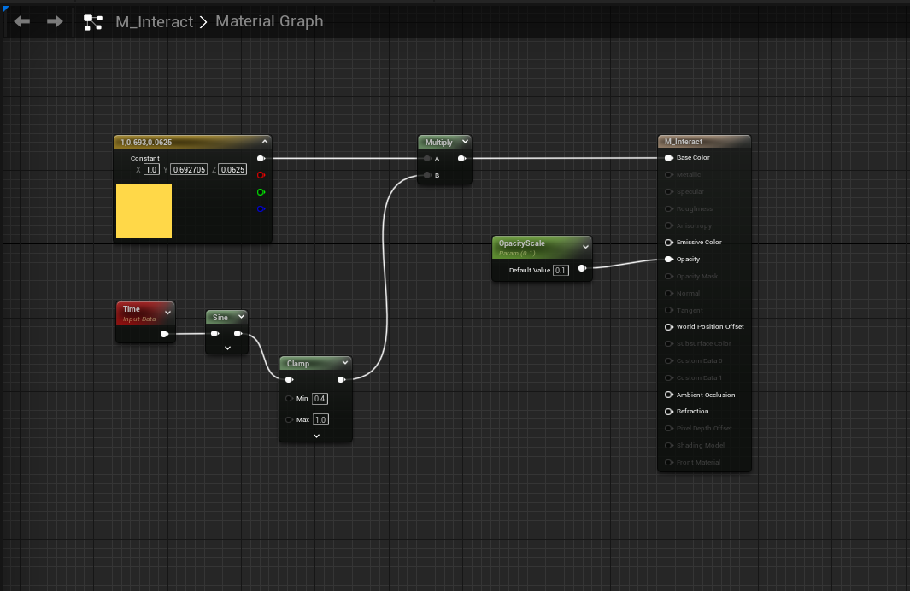


### Widget Blueprint
Widget blueprint to specjalny rodzaj blueprintu, który służy do tworzenia interfejsu użytkownika.
W projekcie odpowiada on za wyświetlacz i umożliwenie obsługi ekspresu przez dotykowy wyświetlacz

**Przykłady:**

- Sprawdzenie czy możliwe jest zrobienie kawy
  
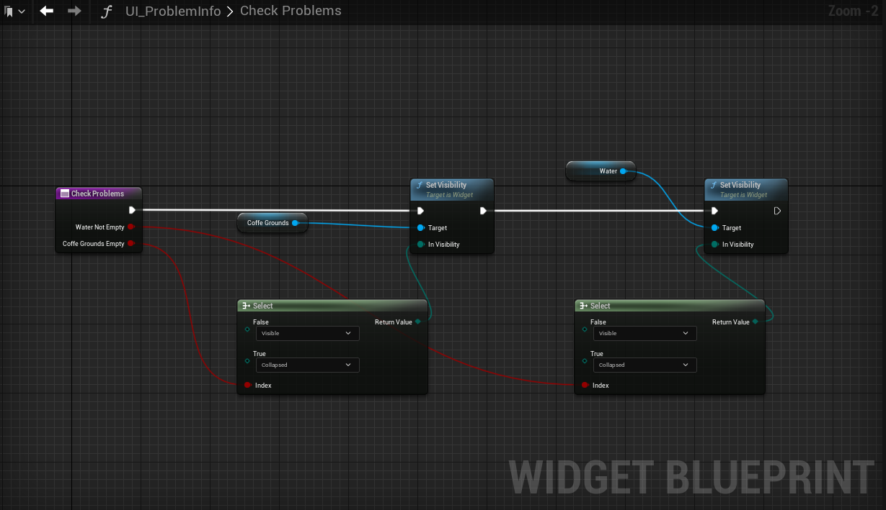


### Uwagi końcowe
Blueprinty mają jedynie na celu pokazać w jaki sposób został skonstruowany projekt i jaki elementy zostały przez nas wykorzystane.
W większości są to powtarzalne konstrukcje, które są odpowiednio dostosowane do danego miejsca w programie.

## Dokumentacja kodu

Na istniejący kod programistyczny składają się następujące pliki:
- CharacterBase.cpp
- CoffeGroundsActor.cpp
- CoffeMachineBase.cpp
- ContainsersComponent.cpp
- HandItem.cpp
- InteractionComponent.cpp
- InteractionInterface.cpp

Zawarte w nich metody slużą do obsługi interakcji użytkownika z otoczeniem i obsługi kamery/widoku.

Z punktu widzenia projektu najważniejszy są pliki InteractionComponent.cpp oraz ContainersComponent.cpp, które rozszerzają klasę UInteractionComponent o metody odpowiedzialne za obslugę ekspresu do kawy.


### InteractionComponent.cpp

W pliku znajdują się następujące metody:

#### Zawartość pliku
```cpp
1. UInteractionComponent::UInteractionComponent()
2. void UInteractionComponent::InitComponnent(ACharacter* PlayerCharacter, APlayerController* PlayerController)
3. void UInteractionComponent::SetCanCheckInteraction(bool CanCheck)
4. void UInteractionComponent::TryToInteract()
5. void UInteractionComponent::BeginPlay()
6. void UInteractionComponent::CheckCurrentActor()
7. void UInteractionComponent::OnLoseActor()
```
#### Opis poszczególnych metod

##### 1. `UInteractionComponent::UInteractionComponent()`


```cpp
// Sets default values for this component's properties
UInteractionComponent::UInteractionComponent()
{
	// Set this component to be initialized when the game starts, and to be ticked every frame.  You can turn these features
	// off to improve performance if you don't need them.
	PrimaryComponentTick.bCanEverTick = true;

	// ...
}
```

Metoda ta inicjalizuje wykorzystanie funkcji Tick dla implementowanego komponentu. 
Funkcja ta jest integralną częścią środowiska Unreal i jest wywoływana podczas renderowania każdej klatki obrazu umożliwiając programowi reakcję.
W przypadku projektowym odpowiednią obsługę wyświetlacza oraz interakcji z shaderami realizującymi fizykę cieczy.

Zmiana ta jest wykonywana poprzez ustawienie pola `PrimaryComponentTick.bCanEverTick` na wartość  `true;`


##### 2. `void UInteractionComponent::InitComponnent(ACharacter* PlayerCharacter, APlayerController* PlayerController)`

```cpp
void UInteractionComponent::InitComponnent(ACharacter* PlayerCharacter, APlayerController* PlayerController)
{
	LocalPlayerCharacter = PlayerCharacter;
	LocalPlayerController = PlayerController;
	CastedPlayerController = Cast<APlayerControllerBase>(PlayerController);
}
```

Pole `LocalPlayerCharacter` przechowuje referencję do obiektu postaci, który jest kontrolowany przez użytkownika. Pole to jest wykorzystywane do określenia pozycji gracza względem innych obiektów w środowisku.

Pole `LocalPlayerController` przechowuje referencję do kontrolera postaci.

Są to standardowe ustawienia dla postaci z widokiem pierwszoosobowym. Który występuje w projekcie.

##### 3. `void UInteractionComponent::SetCanCheckInteraction(bool CanCheck)`

```cpp
void UInteractionComponent::SetCanCheckInteraction(bool CanCheck)
{
	UE_LOG(LogTemp, Warning, TEXT("CAN CHECK CHANGED"));
	CanCheckInteraction = CanCheck;
	OnLoseActor();
}
```

Dodatkowa funkcja umożliwiająca reakcję na opróżnienie butelki z wodą przez użytkownika.
CanCheckInteraction jest polem typu bool, które określa czy użytkownik może wykonać tą interakcję.

Jeśli nie jest możliwa interakcja to zostaje wywołana metoda `OnLoseActor()`. Która resetuje stan butelki do stanu początkowego.

##### 4. `void UInteractionComponent::TryToInteract()`

```cpp
void UInteractionComponent::TryToInteract()
{
	if(CurrentTargetActor==nullptr)
	{
		return;
	}

	if (CurrentTargetActor->GetClass()->ImplementsInterface(UInteractionInterface::StaticClass()))
	{
   		IInteractionInterface::Execute_OnInteraction(CurrentTargetActor, LocalPlayerController);
	}


}
```
Pole `CurrentTargetActor` przechowuje referencję do obiektu, który jest aktualnie podświetlony przez gracza. Jeśli nie jest to żaden obiekt to metoda kończy swoje działanie.

Jeśli obiekt istnieje i implementuje interfejs `UInteractionInterface` to zostaje wywołana metoda `OnInteraction` zaimplementowana w klasie właściwego obiektu, na który wskazuje użytkownik.

##### 5. `void UInteractionComponent::BeginPlay()`

```cpp
void UInteractionComponent::BeginPlay()
{
	Super::BeginPlay();
	
}
```
Typowa metoda wywoływana przy starcie gry. W projekcie nie pełni ona żadnej niestandardowej funkcji.

##### 6. `void UInteractionComponent::CheckCurrentActor()`

```cpp
void UInteractionComponent::CheckCurrentActor()
{
  FVector CameraLocation;
  FRotator CameraRotation;
  LocalPlayerController->GetPlayerViewPoint(CameraLocation, CameraRotation);
  FVector End = CameraLocation + CameraRotation.Vector() * 500.0f;
  FHitResult HitResult;
  FCollisionQueryParams CollisionParams;
  bool bHit = GetWorld()->LineTraceSingleByChannel(HitResult
  											 ,CameraLocation
											 , End
											 , ECC_Visibility
											 , CollisionParams);
 
  if(bHit)
  {
	AActor* HittedActor = HitResult.GetActor();
	if(HittedActor!=nullptr&&HittedActor->GetClass()->ImplementsInterface(UInteractionInterface::StaticClass()))
	{
		CurrentTargetActor = HittedActor;
		UE_LOG(LogTemp, Warning, TEXT("EKSPRES HITED"));
		CastedPlayerController->CreateWidgetOrDestroy(true, IInteractionInterface::Execute_GetInteractText(CurrentTargetActor));
	}else
	{
		OnLoseActor();
	}
	
  }else
  {
       OnLoseActor();
  }
  
  //DrawDebugLine(GetWorld(), CameraLocation, End, FColor::Green, false, 2.0f, 2, 1.0f);

}

```
Metoda ta jest wywoływana w każdej klatce obrazu. Odpowiada ona za weryfikację, czy użytkownik wskazuje na jakiś obiekt w środowisku, szczególnie sprawdzając czy nie wszedł on w interakcje z wyświetlaczem ekspresu do kawy, wybudzając go.

Jeśli się tak stało to funkcja wywołuje metodę `CreateWidgetOrDestroy` z klasy `APlayerControllerBase`, która tworzy widżet wyświetlacza bazując na odpowiedni blueprincie i assetach graficznych.

##### 7. `void UInteractionComponent::OnLoseActor()`

```cpp
void UInteractionComponent::OnLoseActor()
{
	CurrentTargetActor = nullptr;
	UE_LOG(LogTemp, Warning, TEXT("LOSE ACTOR"));
	CastedPlayerController->CreateWidgetOrDestroy(false, "");
}
```
Metoda ta jest wywoływana w każdej klatce obrazu. Odpowiada ona za weryfikację, czy użytkownik wyszedł z interakcji z obiektem.
Jeśli tak jest to funkcja wywołuje metodę `CreateWidgetOrDestroy` z klasy `APlayerControllerBase`, która weryfikuje, które widgety przestały być używane i zwalnia zasoby usuwając je.


### ContainersComponent.cpp

W pliku znajdują się następujące metody:

#### Zawartość pliku
```cpp
1. UContainersComponent::UContainersComponent()
2. void UContainersComponent::UpdateCurrentWaterLevel()
3. void UContainersComponent::UpdateCurrentCoffeLevel()
4. float UContainersComponent::UpdateLevelValue(float Value, float Target)
5. void UContainersComponent::SetNewTargetWaterLevel(float NewTargetWaterLevel)
6. void UContainersComponent::SetNewTargetCoffeGroundsLevel(float NewTargetCoffeGroundsLevel)
7. void UContainersComponent::SetBlockedCoffeUpdate(bool blocked)
8. float UContainersComponent::GetWaterLevel()
9. float UContainersComponent::GetCoffeGroundsLevel()
10. void UContainersComponent::AddToTargetWaterLevel(float Value)
```
#### Opis poszczególnych metod

##### 1. `UContainersComponent::UContainersComponent()`

Konstruktor klasy `UContainersComponent` ustawia domyślne wartości dla właściwości komponentu.

##### 2. `void UContainersComponent::UpdateCurrentWaterLevel()`

Ta funkcja aktualizuje aktualny poziom wody w pojemniku.

##### 3. `void UContainersComponent::UpdateCurrentCoffeLevel()`

Ta funkcja aktualizuje aktualny poziom fusów w pojemniku.

##### 4. `float UContainersComponent::UpdateLevelValue(float Value, float Target)`

Ta funkcja aktualizuje wartość poziomu na podstawie wartości docelowej. Działa uniwersalnie dla poziomu wody i fusów.

##### 5. `void UContainersComponent::SetNewTargetWaterLevel(float NewTargetWaterLevel)`

Ta funkcja ustawia nowy maksymalny poziom wody.

##### 6. `void UContainersComponent::SetNewTargetCoffeGroundsLevel(float NewTargetCoffeGroundsLevel)`

Ta funkcja ustawia nowy maksymalny poziom fusów.

##### 7. `void UContainersComponent::SetBlockedCoffeUpdate(bool blocked)`

Ta funkcja ustawia blokadę aktualizacji poziomu fusów.

##### 8. `float UContainersComponent::GetWaterLevel()`

Ta funkcja zwraca aktualny poziom wody.

##### 9. `float UContainersComponent::GetCoffeGroundsLevel()`

Ta funkcja zwraca aktualny poziom fusów.

##### 10. `void UContainersComponent::AddToTargetWaterLevel(float Value)`

Ta funkcja dodaje wartość do maksymalnego poziomu wody.


## Samouczek obslugi aplikacji

Urządzenie, na którym ma zostać uruchomiona aplikacja musi spełniać następujące wymagania:
- [x] System operacyjny Windows 10
- [x] Dedykowana karta graficzna zgodna z DirectX 11 min. 4GB VRAM (NVIDIA GTX 1060)
- [x] Karta dźwiękowa zgodna z DirectX 11
- [x] Klawiatura i mysz

### 1. Uruchomienie aplikacji

Należy otworzyć pobrać i otworzyć plik `CoffeAnril.exe`.
Po uruchomieniu programu zostanie wyświetlony widok scenerii kuchennej, w której znajduje się ekspres do kawy.

### 2. Sterowanie

#### Poruszanie się
**W** - Ruch do przodu<br>

**S** - Ruch do tyłu<br>

**A** - Ruch w lewo<br>

**D** - Ruch w prawo
#### Sterowanie kamerą
Sterowanie kamerą odbywa się za pomocą ruchu myszy.
#### Interakcje z przedmiotami
**E** - Podniesienie przedmiotu, otworzenie ekspresu do kawy, podniesienie kubka oraz inne czynności interaktywne niezwiązane z obsługą interfejsu ekspresu do kawy.<br>
**R** - Wyjęcie butelki z wodą do napełnienia ekspresu.<br>
**Lewy przycisk myszy [LPM]** - Wypicie kawy z kubka trzymanego w ręce, opróżnienie fusów z pojemnika na fusy.<br>

### Instrukcja przygotowania napoju


1. Należy podejść do ekspresu do kawy korzystając z ruchu kamerą oraz odpowiednich klawiszy.<br>

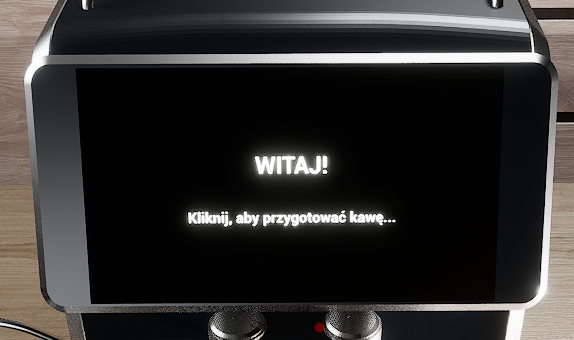

2. Należy nacisnąć lewym przyciskiem myszki na ekspres do kawy.<br>

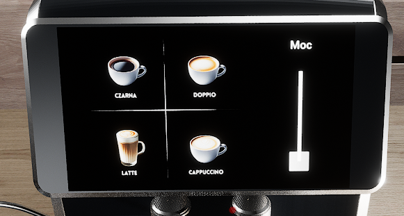

3. Należy nacisnąć lewym przyciskiem myszki na napój który chcemy przygotować.<br>

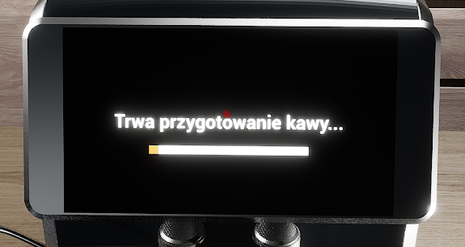

4. Należy chwilę poczekać, aż napój się zrobi<br>

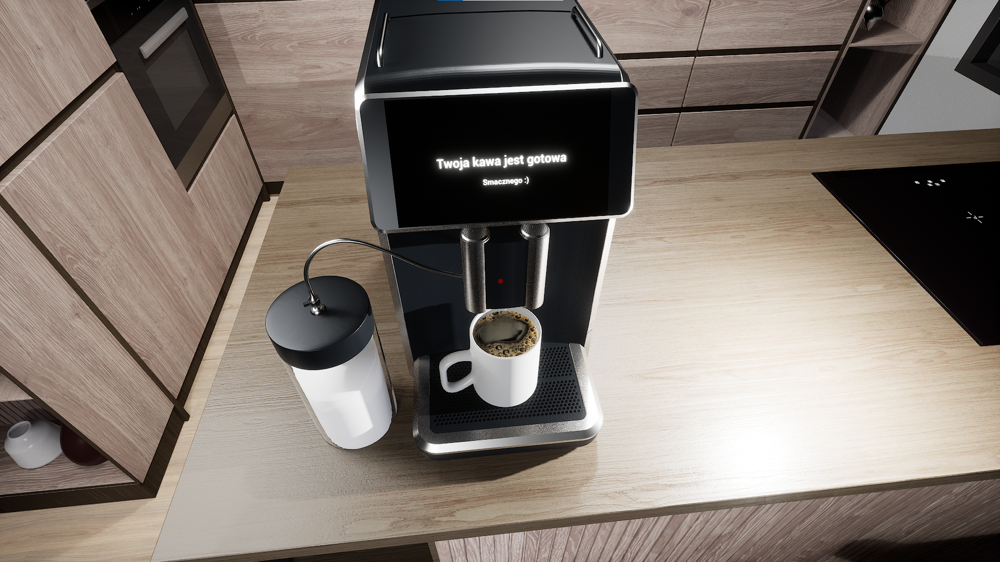

5. Należy podnieść kubek klawiszem E<br>

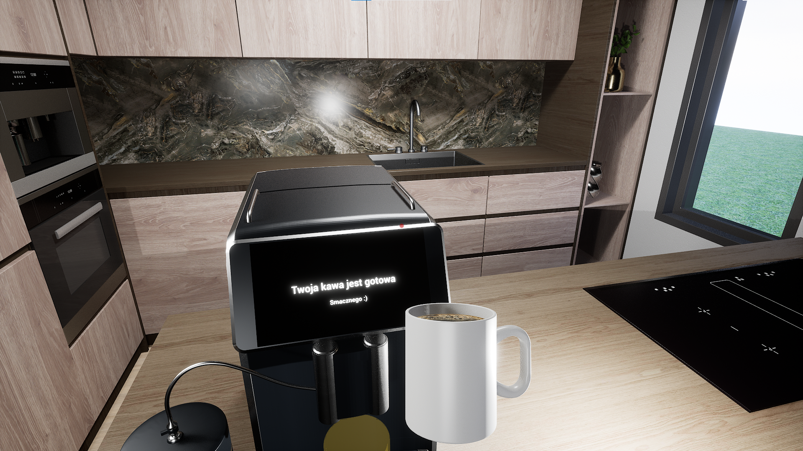

6. Aby wypić kawę należy przytrzymać lewy przycisk myszy.<br>

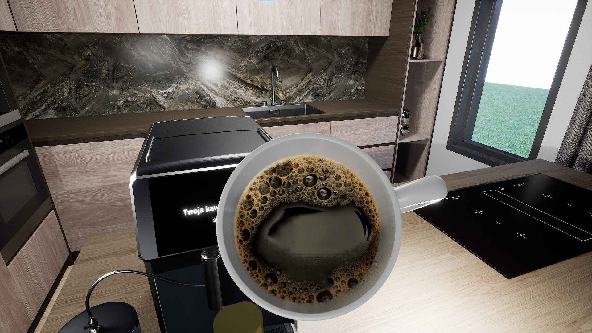

Smacznego!


### Instrukcja dolania wody

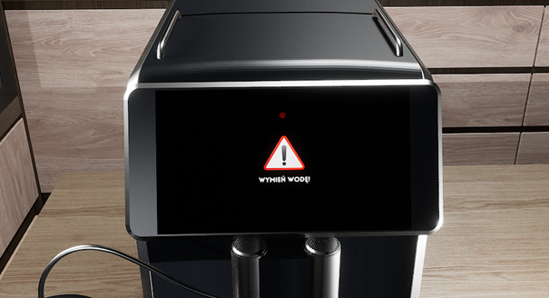

1.	Otwórz tylną pokrywę zbiornika na wodę (E)

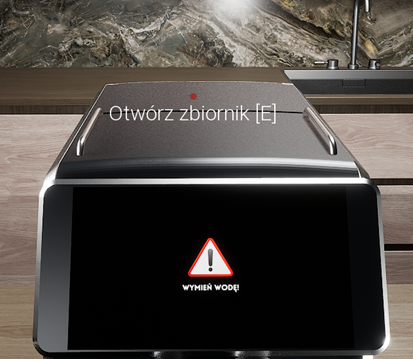

2.	Wyjmij butelkę z wodą (R)

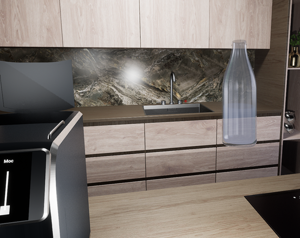

3. Ustaw butelkę odpowiednio wysoko nad zbiornikiem i wciśnij LPM aby rozpocząć proces dolewania wody. Gdy z wyświetlacza zniknie błąd, proces można zakończyć

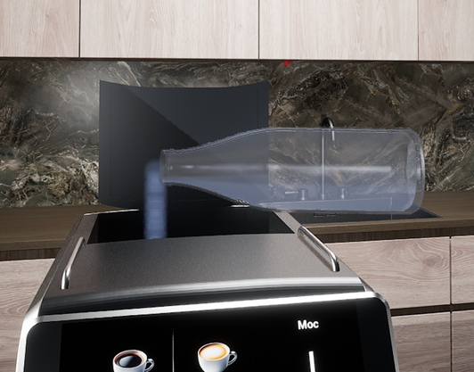

4. Schowaj butelkę z wodą (R) i zamknij pojemnik na wodę (E)


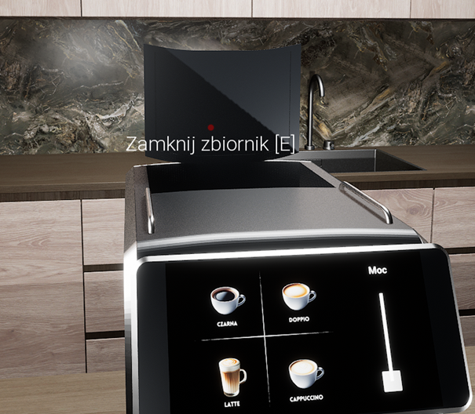


### Instrukcja opróżnienia pojemnika na fusy

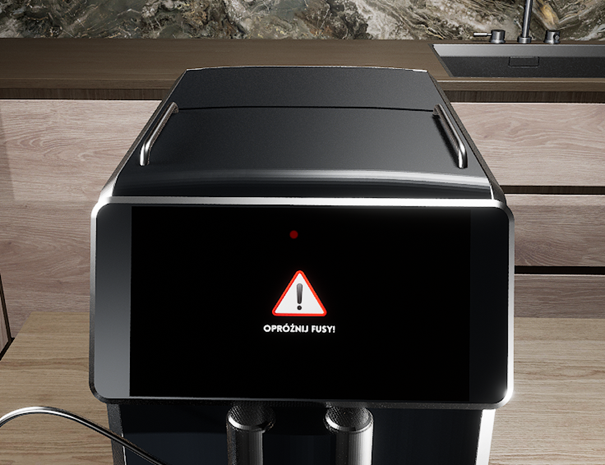

1. Wyjmij pojemnik na fusy (E)

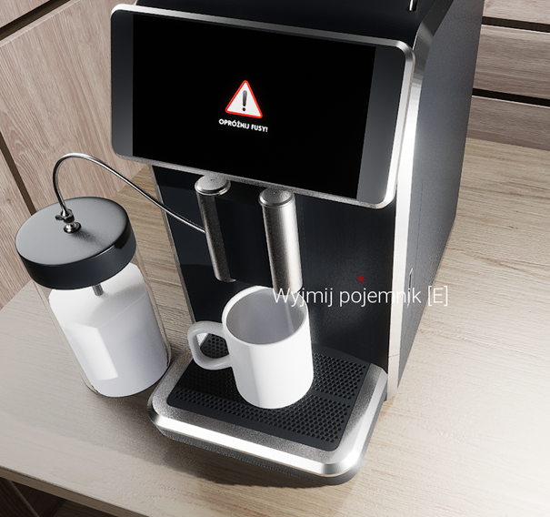

2.	Podejdź do kosza na śmieci i wysyp fusy (LPM)

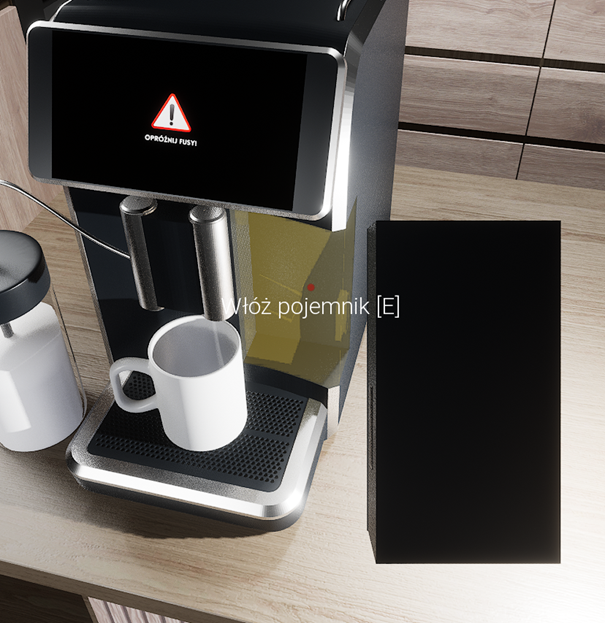

3.	Wstaw ponownie pojemnik do kawiarki (E)

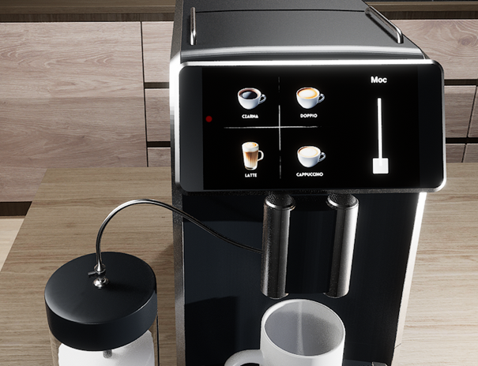

4.	Komunikat powinien zniknąć. Można przystąpić do przygotowania napoju.


   


